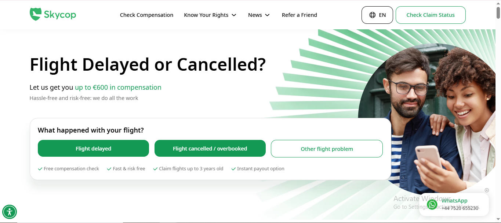
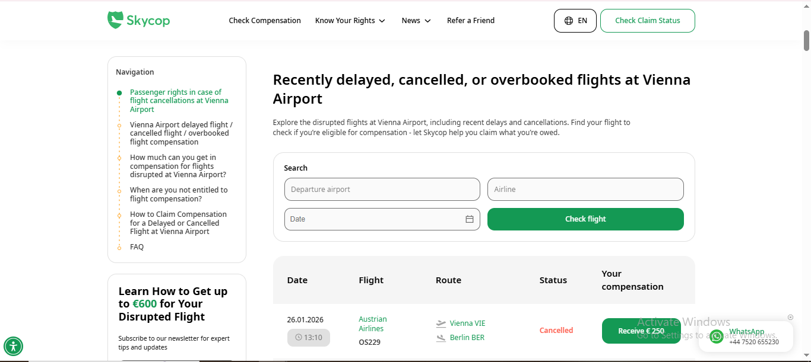

✈️ Skycop – Flight Compensation & Passenger Rights Platform

🔗 Website: https://www.skycop.com/

🛫 Industry: Air Passenger Rights & Flight Compensation
🌍 Content Responsibility: Content creation, localization & multilingual publishing

    📌 Project Overview
        Skycop is a leading digital platform that helps air travelers claim compensation for disrupted flights such as:
           -  Flight delays
           -  Flight cancellations
           -  Overbooked flights
           -  Missed connections
           -  Denied boarding
         The site provides an easy online process for passengers to check eligibility and submit compensation claims under EU Regulation EC 261/2004 and other international passenger rights laws.

    ✍️ My Role & Contribution
        I am responsible for:
          📝 Content Creation
            -  Writing informative articles and web content for the Skycop platform
            -  Crafting detailed passenger-rights guides
            -  Explaining claims procedures clearly for travelers

          🌐 Multilingual Publishing
              Creating localized content in multiple languages, such as:
                -  Estonian
                -  Finnish
                -  Portuguese
                -  Dutch
                -  Danish
                -  Russian
                -  And many languages more...
              This ensures global users can access compensation guidance in their own language.

     📊 Key Features Covered in Content
         📌 Flight Compensation Guides
         
             ✔ Delayed flight compensation
             ✔ Cancelled flight compensation
             ✔ Overbooking compensation
             ✔ Missed connection claims
             ✔ Denied boarding rights
             ✔ Baggage delay & loss claims
          These articles guide users through each step of understanding their legal rights and claim process.

📸 Screenshots (See Below)
### 🏠 APPR Page

### 🏠 Airline Page

### 🏠 Airport Page

